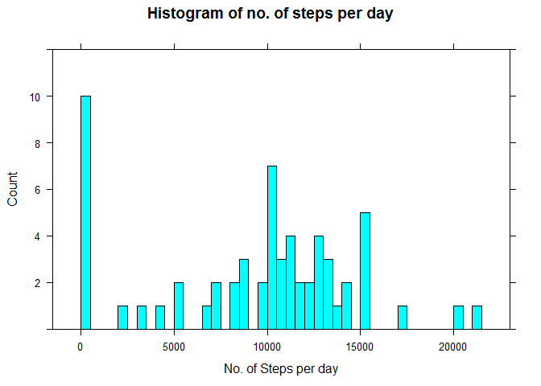
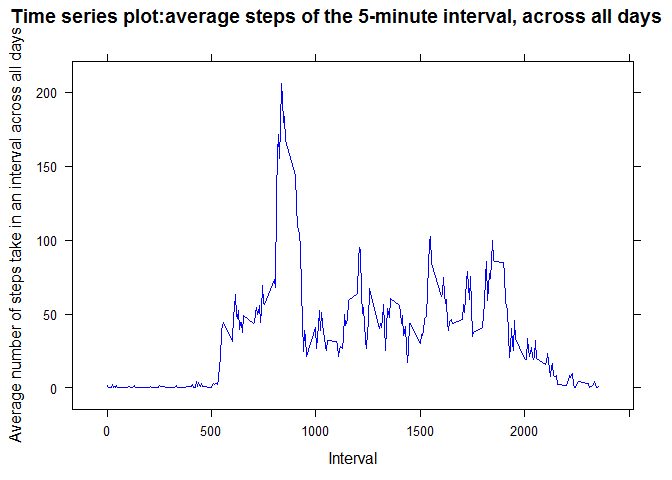
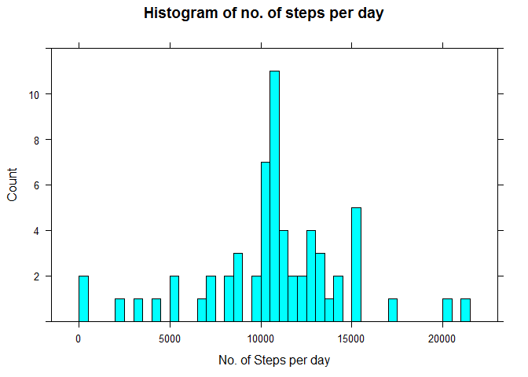
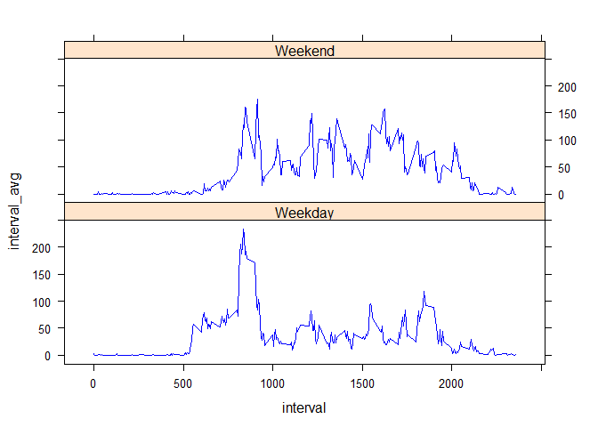

# Reproducible Research: Peer Assessment 1
Aashish Shetty  

### Report generated on June 12, 2015


## Loading and preprocessing the data

```r
    #Load Libraries needed
    library(data.table)
    library(dplyr)
    library(lattice)

    #Load the data (i.e. read.csv())
    csv<-read.csv("activity.csv",as.is=F )

    #Transform  data to data table to help with analysis
    data_table<-data.table(csv)
```

***  


## What is mean total number of steps taken per day?

```r
    by_date<-group_by(data_table,date)
    steps_summary<-summarise(by_date,step_count=sum(steps,na.rm=T))
    histogram(~step_count,
        data=steps_summary,
        type="count",
        ylim=c(0,12),
        breaks=40,
        xlab="No. of Steps per day",
        main="Histogram of no. of steps per day")
```

 

####Mean of number of steps taken each day is  9354.2295  
####Median of number of steps taken each day is 10395   
  
***  
  
## What is the average daily activity pattern?


```r
by_interval<-group_by(data_table,interval)
interval_summary<-summarise(by_interval,interval_avg=mean(steps,na.rm=T))

xyplot( interval_avg ~ interval,
    data = interval_summary,
    type = "l",
    xlab= "5- minute Interval", 
    ylab= "Average number of steps take in an interval across all days",
    main="Time series plot:average steps of the 5-minute interval, across all days",
    col.line = c(rep("blue",3), "red"))
```

 


####On average across all the days in the dataset, the 5-minute interval 835 contains the maximum number of steps
    
***  

## Imputing missing values

####Total number of missing values in the dataset 2304

###Strategy for Imputing missing values
####Replace missing values with the with mean for that 5-minute interval. This has been saved in interval_summary in the previous step


```r
new_data_table<-copy(data_table)

for(i in which(is.na(new_data_table$steps)))
{
    new_data_table[i]$steps = 
        as.integer(interval_summary[interval==new_data_table[i]$interval]$interval_avg)
}

by_date2<-group_by(new_data_table,date)
steps_summary2<-summarise(by_date2,step_count=sum(steps,na.rm=T))

histogram(~step_count,
    data=steps_summary2,
    type="count",
    ylim=c(0,12),
    breaks=40,
    xlab="No. of Steps per day",
    main="Histogram of no. of steps per day after imputing missing values")
```

 


####Before imputing data Mean of no. of steps was 9354.2295  , after imputing missing data it has increased to 10749.7705   
####Before imputing data Median of no. of steps is 10395, after imputing missing data it has increased to 10641

####Hence after imputing missing data, the median and mean increased slightly 
***  

## Are there differences in activity patterns between weekdays and weekends?


```r
isWeekday<-function(x){
    if(grepl("Sunday|Saturday",x))
        return("Weekend")
    else
        return("Weekday")
}

#Add Weekday/Weekend - day of the week column as day
data_table<-data_table[,day:=sapply(weekdays(as.Date(date , format = "%Y-%m-%d")),isWeekday)]

day_interval<-group_by(data_table,day,interval)
week_summary<-summarise(day_interval,interval_avg=mean(steps,na.rm=T))

xyplot( interval_avg ~ interval| day,
    data = week_summary,
    type = "l",
    lty = c(1, 2, 2, 1),
    lwd = c(1, 1, 1, 3),
    layout=c(1,2),
    xlab= "5- minute Interval", 
    ylab= "Average number of steps take in an interval across all days",
    col.line = c(rep("blue",3), "red"),
    main="Comparison between Weekday and weekend activity")
```

 


